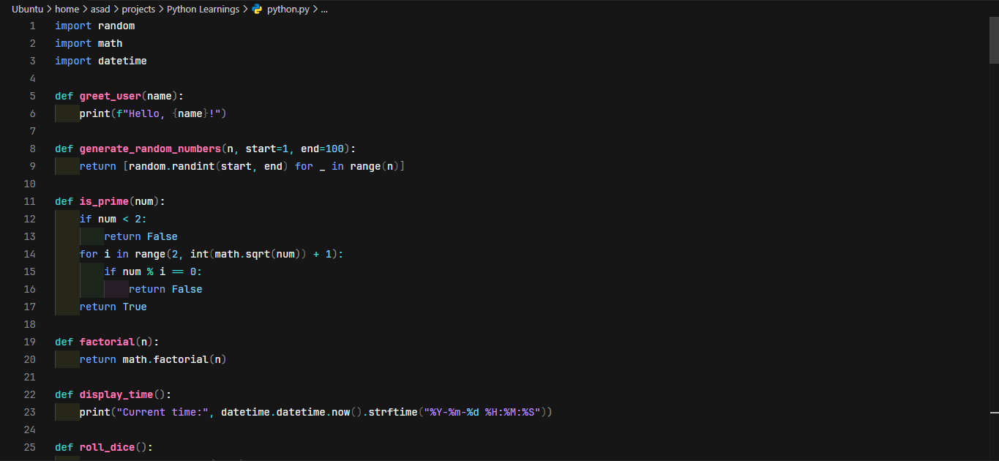

# 🌑 Oxocarbon Dark Theme

> A sleek, modern dark theme inspired by IBM’s Carbon Design System, adapted for developers who love a professional, low-contrast, high-focus UI.

---

## 🎯 Features

- Based on the **[Oxocarbon](https://github.com/nyoom-engineering/oxocarbon-theme)** design
- Works in **VS Code**, **Eclipse Theia**, and any other VS Code-compatible IDE
- Carefully tuned colors for:
  - Syntax
  - UI chrome
  - Git decorations
  - Terminals
  - Markdown & TOML
- Great with **JetBrains Mono**, **IBM Plex**, or **FiraCode**

---

## 📦 Installation

### From `.vsix`

1. Download the latest `.vsix` from the [Releases](https://github.com/your-username/oxocarbon-dark-theme/releases) page
2. In VS Code or Theia:
   - Open Command Palette → `Extensions: Install from VSIX...`
   - Select the downloaded file
3. Change your color theme:
   - `Preferences: Color Theme` → `Oxocarbon Dark`

### From Open VSX (optional)

> Coming soon — to be published at [open-vsx.org](https://open-vsx.org/)

---

## 🖥️ Screenshot

---

## 🧩 Compatibility

- ✅ Visual Studio Code (v1.80+)
- ✅ Eclipse Theia (any version)
- ✅ Gitpod, Coder, and other web-based VS Code platforms

---

## 📁 Repository Structure

